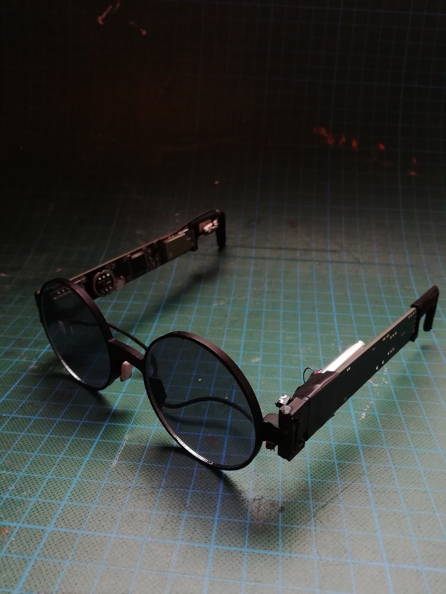

# design files and firmware for spectacle version 0
design files for the proof of concept prototype of the spectacle smart glasses project

## project directory
 * firmware    - arduino sketch for stm32duino on STM32F401  
 * lib         - arduino libraries, for sketch  
 * hardware    - gerber files, schematics and {2,3}D renders  
 * models      - 3d models of frames  